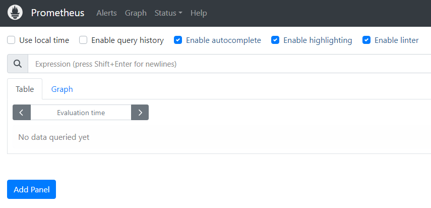
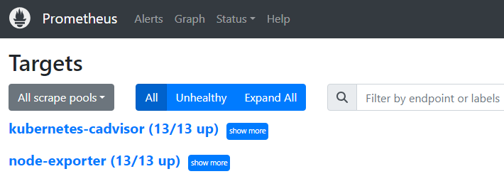
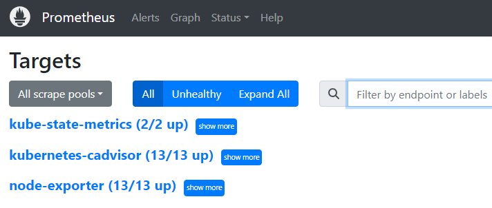
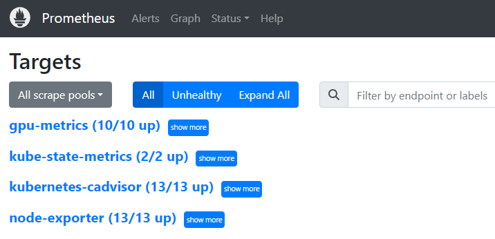
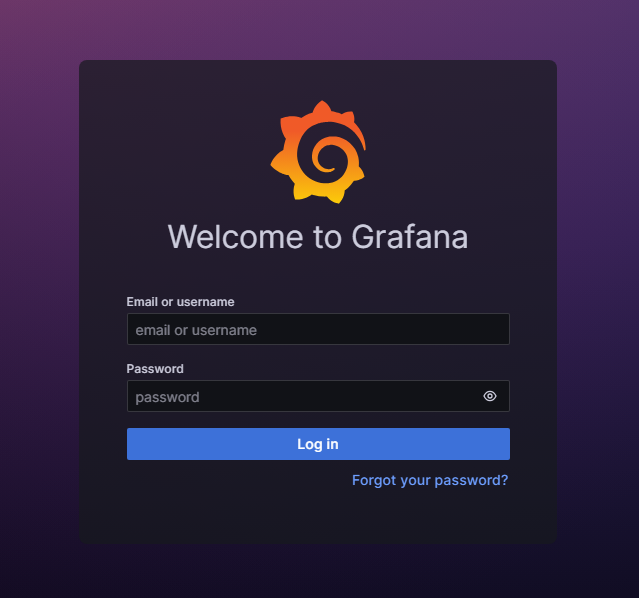
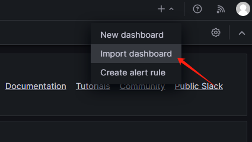
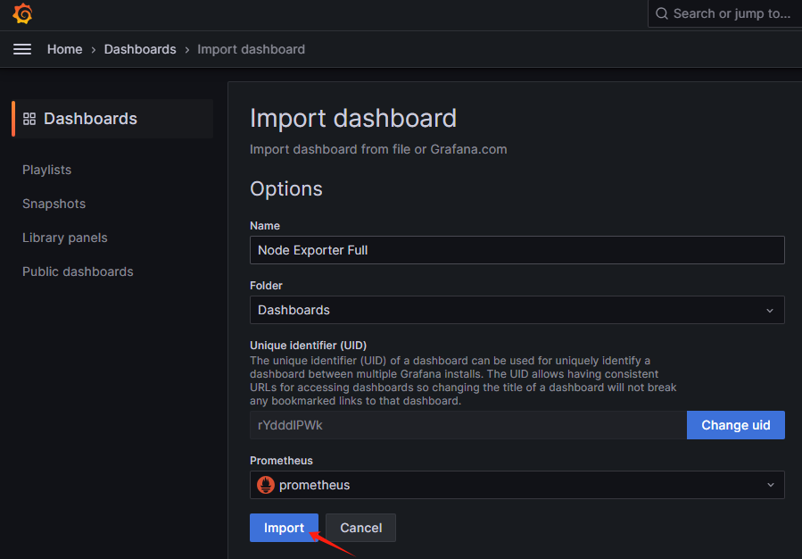
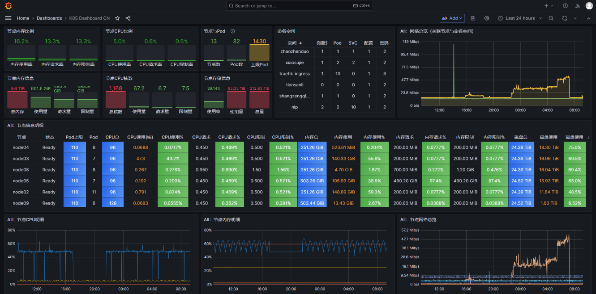
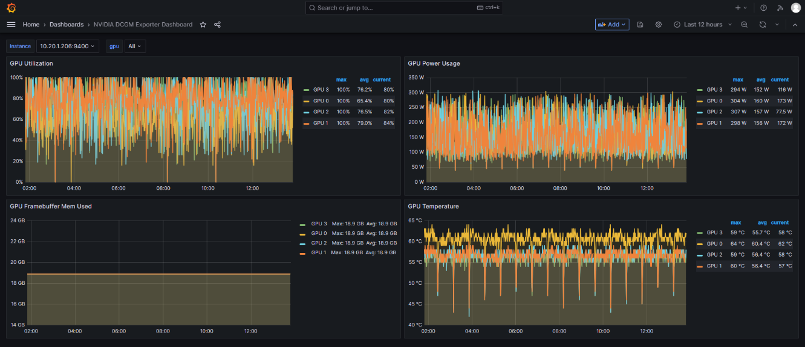

## 一、K8s监控数据持久化
（注意：经测试发现prometheus数据存储不能使用nfs、包括gpfs，会有丢数据的情况发生，这里数据统一存储在node08节点）
#### 1、登录node08，创建monitoring存储目录：
```shell
root@node08:~# mkdir -p /data/monitoring
root@node08:~# cd /data/monitoring
```

#### 2、创建prometheus存储路径：
```shell
root@node08:/data/monitoring# mkdir prometheus
root@node08:/data/monitoring# chown 65534:65534 prometheus/
```

#### 3、创建grafana存储路径：
```shell
root@node08:/data/monitoring# mkdir grafana
root@node08:/data/monitoring# chown 472:0 grafana/
```


## 二、K8s集群中创建monitoring命名空间并下载monitoring相关包
#### 1、创建monitoring命名空间
```shell
root@master01:~# kubectl create ns monitoring
namespace/monitoring created
```

#### 2、下载monitoring相关软件包：
```shell
root@master01:~# wget http://pypi.speech.local/extras/Kubernetes/k8s-monitoring-202312.tar.gz
```

#### 3、解压：
```shell
root@master01:~# tar zxf k8s-monitoring-202312.tar.gz
```


## 三、部署node-exporter
#### 1、按需调整镜像源：
```shell
root@master01:~# cd k8s-monitoring/node-exporter-v1.6.1/
root@master01:~/k8s-monitoring/node-exporter-v1.6.1# vim node-exporter.yaml +20
20         image: hub.speech.local/prom/node-exporter:v1.6.1                  # 注意镜像要提前推送到Harbor
```

#### 2、部署node-exporter：
```shell
root@master01:~/k8s-monitoring/node-exporter-v1.6.1# kubectl apply -f node-exporter.yaml
daemonset.apps/node-exporter created
service/node-exporter created
```


## 四、部署prometheus
#### 1、授予monitoring空间defualt用户权限
```shell
root@master01:~/k8s-monitoring/prometheus-v2.45.1# kubectl apply -f cluster-role-binding.yaml 
clusterrole.rbac.authorization.k8s.io/prometheus created
clusterrolebinding.rbac.authorization.k8s.io/prometheus created
```
#### 2、创建prometheus config map
```shell
root@master01:~/k8s-monitoring/prometheus-v2.45.1# kubectl apply -f config-map.yaml 
configmap/prometheus-config created
```

#### 3、调整prometheus配置：
```shell
root@master01:~/k8s-monitoring/prometheus-v2.45.1# vim prometheus.yaml
 19     spec:
 20       nodeSelector:
 21         kubernetes.io/hostname: node08                                     # 注意prometheus部署在node08节点
 22       containers:
 23       - name: prometheus
 24         image: hub.speech.local/prom/prometheus:v2.45.1                    # 注意镜像提前推送到Harbor
```
```shell
 56       # prometheus storage
 57       - name: storage
 58         hostPath:
 59           # storage directory permission: chown 65534:65534 ${storage}
 60           path: /data/monitoring/prometheus                                # 调整存储路径
```

#### 4、部署prometheus：
```shell
root@master01:~/k8s-monitoring/prometheus-v2.45.1# kubectl apply -f prometheus.yaml
deployment.apps/prometheus created
service/prometheus created
```

#### 5、添加ingress规则：
```shell
root@master01:~/k8s-monitoring/prometheus-v2.45.1# vi ingress.yaml
  1 apiVersion: traefik.containo.us/v1alpha1
  2 kind: IngressRoute
  3 metadata:
  4   name: prometheus-ingress
  5   namespace: monitoring
  6 spec:
  7   entryPoints:
  8   - web
  9   routes:
 10   - match: Host(`prometheus.speech.local`) && PathPrefix(`/`)               # 按需调整域名
 11     kind: Rule
 12     services:
 13     - name: prometheus
 14       namespace: monitoring
 15       port: 9090
```
```shell
root@master01:~/k8s-monitoring/prometheus-v2.45.1# kubectl apply -f ingress.yaml
ingressroute.traefik.containo.us/prometheus-ingress created
```

#### 6、通过浏览器访问以下链接能打开prometheus界面（确保域名能够正常解析到集群）：
http://prometheus.speech.local



#### 7、点击 "Status" -> "Targets"：



## 四、部署kube-state-metrics
#### 1、创建sa账号：
```shell
root@master01:~/k8s-monitoring/kube-state-metrics-v2.4.2# kubectl apply -f service-account.yaml 
serviceaccount/kube-state-metrics created
```

#### 2、创建cluster role：
```shell
root@master01:~/k8s-monitoring/kube-state-metrics-v2.4.2# kubectl apply -f cluster-role.yaml 
clusterrole.rbac.authorization.k8s.io/kube-state-metrics created
```

#### 3、创建cluster role binding：
```shell
root@master01:~/k8s-monitoring/kube-state-metrics-v2.4.2# kubectl apply -f cluster-role-binding.yaml 
clusterrolebinding.rbac.authorization.k8s.io/kube-state-metrics created
```

#### 4、部署kube-state-metrics
```shell
root@master01:~/k8s-monitoring/kube-state-metrics-v2.4.2# vim kube-state-metrics.yaml
 23       containers:
 24       - image: hub.speech.local/registry.k8s.io/kube-state-metrics:v2.4.2          # 注意镜像提前推送到Harbor
```
```shell
root@master01:~/k8s-monitoring/kube-state-metrics-v2.4.2# kubectl apply -f kube-state-metrics.yaml
deployment.apps/kube-state-metrics created
service/kube-state-metrics created
```

#### 5、查看 Prometheus "Status" -> "Targets"：



## 五、部署dcgm-exporter
#### 1、部署dcgm-exporter：
```shell
root@master01:~/k8s-monitoring/dcgm-exporter-v3.1.7# vim dcgm-exporter.yaml
 37       # GPU Node Label: GPU.Support 
 38       affinity:
 39         nodeAffinity:
 40           requiredDuringSchedulingIgnoredDuringExecution:
 41             nodeSelectorTerms:
 42             - matchExpressions:
 43               - key: "GPU.Support"                     # 注意"GPU.Support"标签
 44                 operator: Exists
 45       hostNetwork: true
 46       containers:
 47       - image: "hub.speech.local/nvidia/k8s/dcgm-exporter:3.2.5-3.1.7-ubuntu20.04"  # 注意镜像提前推送到Harbor
```
```shell
root@master01:~/k8s-monitoring/dcgm-exporter-v3.1.7# kubectl apply -f dcgm-exporter.yaml
daemonset.apps/dcgm-exporter created
service/dcgm-exporter created
```

#### 2、查看 Prometheus "Status" -> "Targets"：



## 六、部署Grafana
#### 1、部署config map：
```shell
root@master01:~/k8s-monitoring/grafana-v9.5.14# kubectl apply -f config-map.yaml
configmap/grafana-datasources created
```

#### 2、调整Grafana配置：
```shell
root@master01:~/k8s-monitoring/grafana-v9.5.14# vim grafana.yaml
 16     spec:
 17       affinity:
 18         podAffinity:
 19           requiredDuringSchedulingIgnoredDuringExecution:
 20           - labelSelector:
 21               matchLabels:
 22                 app: prometheus                                                    # 和prometheus pod亲和
 23             topologyKey: "kubernetes.io/hostname"
 24       containers:
 25       - name: grafana
 26         image: hub.speech.local/grafana/grafana:9.5.14-ubuntu                      # 注意镜像提前推送到Harbor
```
```shell
 43       volumes:
 44         - name: grafana-storage
 45           hostPath:
 46             path: /data/monitoring/grafana                                         # 调整存储路径
 47         - name: grafana-datasources
 48           configMap:
 49               defaultMode: 420
 50               name: grafana-datasources
```

#### 3、部署Grafana：
```shell
root@master01:~/k8s-monitoring/grafana-v9.5.14# kubectl apply -f grafana.yaml
deployment.apps/grafana created
service/grafana created
```

#### 4、添加ingress规则：
```shell
root@master01:~/k8s-monitoring/grafana-v9.5.14# vim ingress.yaml
  1 apiVersion: traefik.containo.us/v1alpha1
  2 kind: IngressRoute
  3 metadata:
  4   name: grafana-ingress
  5   namespace: monitoring
  6 spec:
  7   entryPoints:
  8   - web
  9   routes:
 10   - match: Host(`grafana.speech.local`) && PathPrefix(`/`)                         # 按需调整域名
 11     kind: Rule
 12     services:
 13     - name: grafana
 14       namespace: monitoring
 15       port: 3000
```
```shell
root@master01:~/k8s-monitoring/grafana-v9.5.14# kubectl apply -f ingress.yaml
ingressroute.traefik.containo.us/grafana-ingress created
```

#### 5、通过浏览器访问以下链接能打开grafana界面（确保域名能够正常解析到集群）：
http://grafana.speech.local 
(默认账号/密码：admin/admin)



## 七、导入Grafana监控模板
#### 1、导入模板 Node-Exporter-Full.json、K8S-Dashboard-CN.json、NVIDIA-DCGM-Exporter-Dashboard.json：
 <br />


#### 2、查看K8s监控
 <br />



